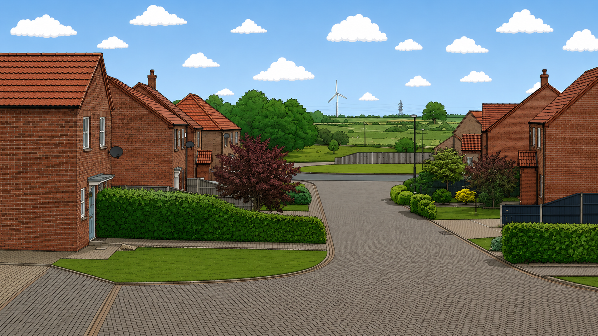

# Weather Scene Layers

This project is a static HTML weather scene built from layered PNG assets. The
base illustration is combined with sky, object, weather, and effect overlays so
different weather states can be previewed without regenerating the original
artwork.

The idea for this project was based on [Dunstan Orchard's incredible
panorama](https://1976design.com/blog/colophon/#the-pano).

I took a photo from my house and used an LLM to create all the illustration assets.

## Scene Options

The form controls these scene properties:

- Time of day: day, sunrise, sunset, night with a full moon, or night with a
  crescent moon.
- Clouds: none, few, or many.
- Rain: none, light, or heavy.
- Snow: none, light, or heavy.
- Wind: none, light, or strong.
- Fog: on or off.

The time of day determines sun, moon and stars automatically. Night scenes also
enable the lighting overlay.

Heavy rain enables the puddle layer. Wind enables wind-line overlays and
controls the turbine blade animation speed.

## Buttons

- `Reset` restores the default scene state.
- `Random` picks random values from each option.

## Local Meteocons

The option icons come from the npm package `@meteocons/svg`. Run `npm install`
to install dependencies and sync the referenced fill-style SVGs into
`assets/icons/meteocons`.

After adding or removing `data-meteocon` values in `index.html`, run
`npm run sync:meteocons`. `npm test` verifies that every referenced icon exists
locally and that the app is not using the hosted Meteocons CDN.
